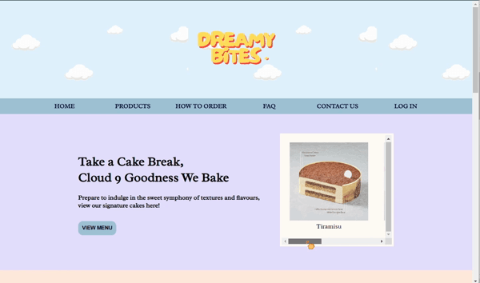
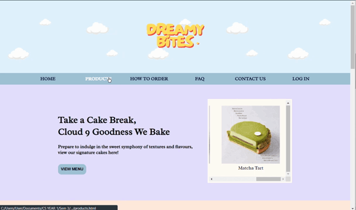
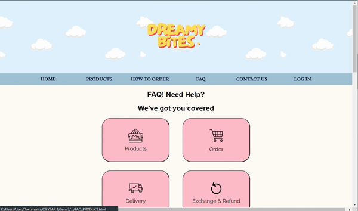

# Dreamy Bites Website

## Overview 
An interactive website for a bakery to dynamically display the menu, FAQs, background and handle customer enquiries. 

## Prototype Building
The prototype was built using [Figma (see here)](https://www.figma.com/design/UDnjXYUsSat6Rmu6AGTFsR/Dreamy-Bites-Prototype?node-id=0-1&t=8hktcwtW6k9K39bP-1).

# Home Page Demonstration

# Menu Page Demonstration

# FAQ Page Demonstration

